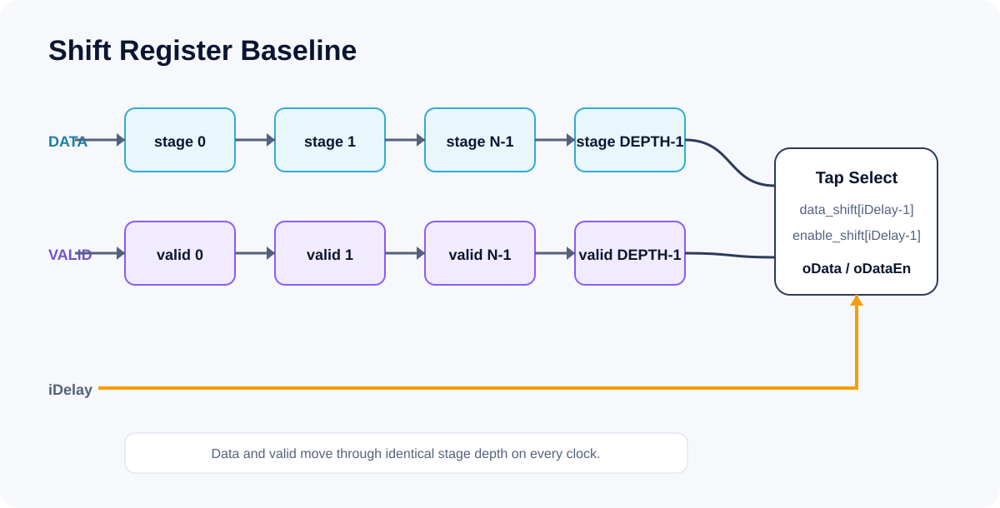

# Project 1 — Shift Register Baseline

This baseline implements a programmable delay as parallel data and valid shift pipelines. It establishes the cycle semantics later preserved by the circular-addressed designs.



## Problem

Delay a 16-bit input by a runtime-selected number of clocks while preserving exact alignment between the data word and its validity.

## Architecture

- `DATA_WIDTH=16`, `DEPTH=10`
- 3-bit `iDelay`, as defined by the supplied baseline interface
- active-low asynchronous reset `iRsn`
- `data_shift[0:DEPTH-1]` and `enable_shift[DEPTH-1:0]`
- `iDelay=N` selects stage `N-1`
- invalid outputs use `oDataEn=0` and `oData=0`

Every stage shifts on every enabled clock edge; the design is intentionally simple and serves as the architectural baseline.

## Key RTL

```systemverilog
for (stage = DEPTH-1; stage > 0; stage = stage - 1) begin
    data_shift[stage]   <= data_shift[stage-1];
    enable_shift[stage] <= enable_shift[stage-1];
end

oDataEn = enable_shift[iDelay-1];
oData   = enable_shift[iDelay-1] ? data_shift[iDelay-1] : '0;
```

## Verification

The supplied testbench drives:

1. asserted reset followed by release;
2. `16'h1001` through `16'h1006` with `iDelay=3`;
3. a runtime delay transition from 2 to 5.

This project uses manual waveform eye-checking rather than an automatic checker. The committed PNGs are **Expected Waveform** diagrams generated for inspection, not ModelSim screenshots.

| Evidence | Status |
|---|---|
| RTL and testbench | Source available |
| Expected cycle table | Documented |
| ModelSim execution | Not rerun; local ModelSim required |
| Quartus compilation | Not rerun; local Quartus Prime Pro required |

## Reproduce

From `01_shift_register_baseline/modelsim`:

```bat
run_modelsim_gui.bat
run_modelsim_batch.bat
```

From `01_shift_register_baseline/quartus` in a Quartus Prime Pro command prompt:

```bat
run_quartus_compile.bat
```

The Quartus project targets Agilex 5 `A5ED065BB32AE6SR0`, uses virtual pins, and applies a 10 ns clock constraint.

## Limitations

- The 3-bit baseline interface cannot select delays above 7 even though `DEPTH` defaults to 10.
- The supplied scenarios use delays 2, 3, and 5; `iDelay=0` is not part of the baseline contract.
- No automatic scoreboard, preserved simulation transcript, or synthesis report is claimed.

See [provenance](PROVENANCE.md) and the [expected waveform table](results/expected_waveform_table.csv).

