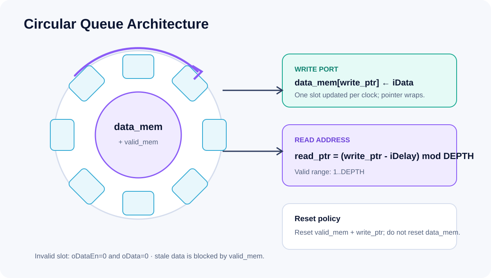
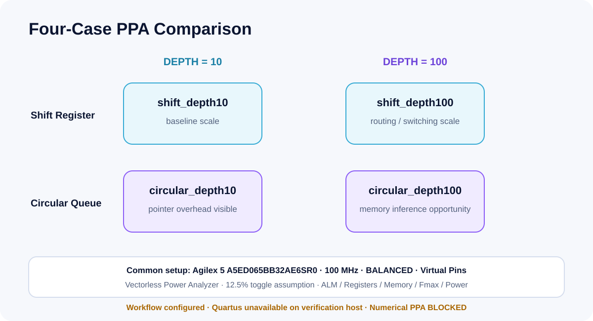
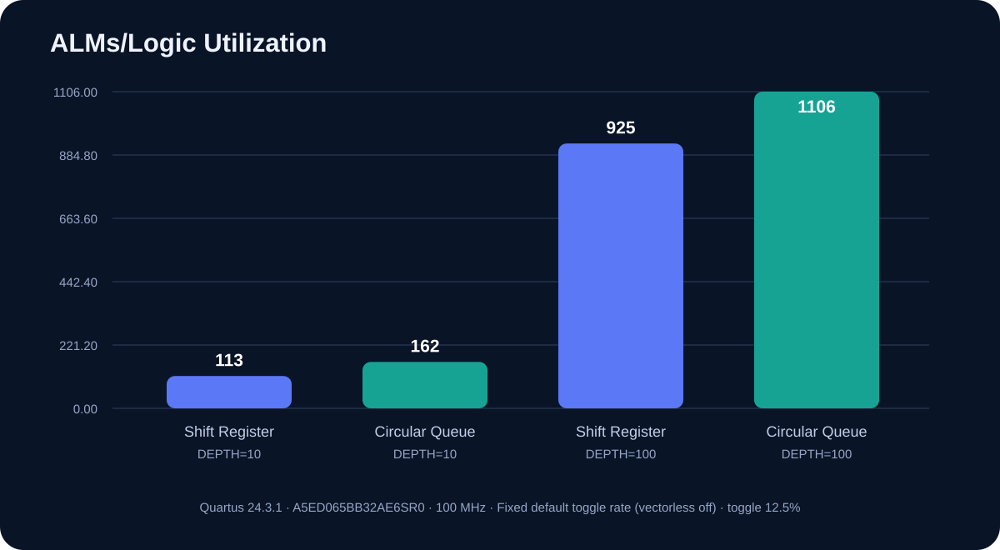
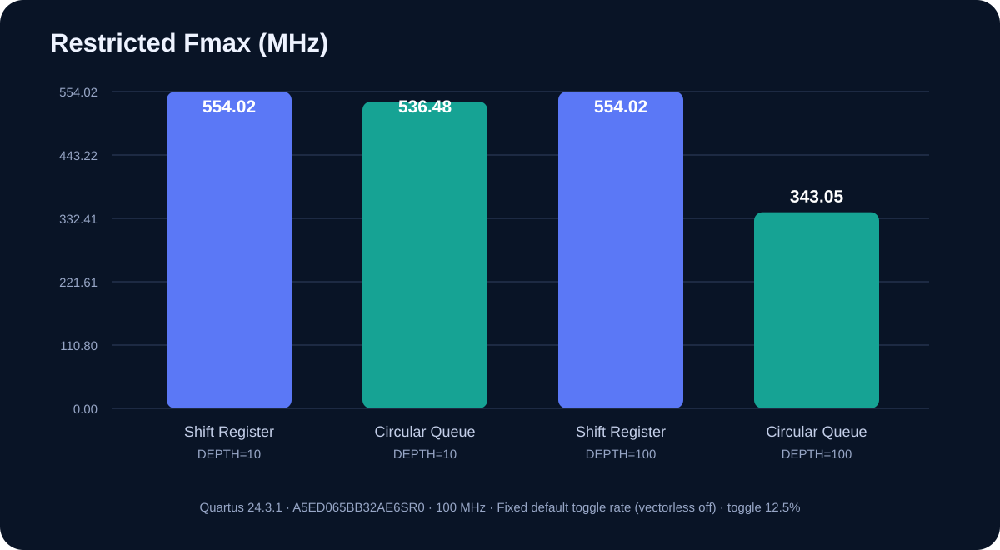

# Project 2 — Circular Queue and PPA Workflow

This project replaces whole-pipeline shifting with a circular time-slot store and prepares an apples-to-apples four-case Quartus PPA study.



## Problem

The shift-register baseline moves all stored data and valid bits every clock. The circular queue updates one slot per clock and reads the slot at `(write_ptr - iDelay) mod DEPTH`.

## Architecture

- 16-bit `data_mem` plus one `valid_mem` bit per slot
- circular `write_ptr`, wrapping at `DEPTH-1`
- `DELAY_WIDTH=$clog2(DEPTH+1)`
- valid delay range `1..DEPTH`
- invalid delay or invalid slot produces `oDataEn=0`, `oData=0`
- `data_mem` is not reset; reset clears `valid_mem` and `write_ptr`

The validity array prevents stale memory content from being exposed. Avoiding a data-array reset also removes a wide reset network and leaves memory inference available to Quartus, subject to the selected device and synthesis result.

## PPA Matrix



| Architecture | DEPTH | Top-level entity |
|---|---:|---|
| Shift Register | 10 | `shift_depth10` |
| Circular Queue | 10 | `circular_depth10` |
| Shift Register | 100 | `shift_depth100` |
| Circular Queue | 100 | `circular_depth100` |

Common constraints:

- Agilex 5 `A5ED065BB32AE6SR0`
- 100 MHz / 10 ns
- `BALANCED` optimization
- virtual pins
- vectorless power estimation
- 12.5% default toggle assumption

Collected fields include logic utilization/ALMs, registers, memory bits or blocks, Fmax, total power, core dynamic power, and static power.

## Current PPA Status

The supplied Project 2 RTL and stimulus-only testbench were first rerun unchanged
with ModelSim Intel FPGA Starter Edition 10.5b. Compilation completed with zero
errors and zero warnings and the stimulus reached `$finish` at 320 ns. Because
that testbench has no checker, this is recorded as **COMPILE + STIMULUS
COMPLETE**, not PASS. The separate Icarus regression supplies the 26
architecture-equivalence checks.

Quartus Prime Pro 24.3.1 then completed synthesis, Fit, Timing Analyzer, and
Power Analyzer for all four controlled cases:

| Architecture | DEPTH | ALMs | Registers | RAM blocks | Fmax / restricted Fmax (MHz) | Setup / hold slack (ns) | Dynamic / total power (W) |
|---|---:|---:|---:|---:|---:|---:|---:|
| Shift Register | 10 | 113 | 175 | 0 | 1108.65 / 554.02 | 9.098 / 0.117 | 0.737 / 2.113 |
| Circular Queue | 10 | 162 | 178 | 0 | 536.48 / 536.48 | 8.136 / 0.139 | 0.737 / 2.113 |
| Shift Register | 100 | 925 | 1851 | 0 | 833.33 / 554.02 | 8.800 / 0.112 | 0.742 / 2.118 |
| Circular Queue | 100 | 1106 | 1714 | 0 | 343.05 / 343.05 | 7.085 / 0.152 | 0.744 / 2.121 |

### What the reports actually show

- At `DEPTH=10`, the circular queue uses 43.4% more ALMs and 1.7% more
  registers. Restricted Fmax is 3.2% lower.
- At `DEPTH=100`, the queue reduces registers by 7.4%, but uses 19.6% more
  ALMs. Restricted Fmax is 38.1% lower and setup slack is 19.5% lower.
- Both circular cases report zero block-memory bits and zero RAM blocks. The
  current asynchronous indexed read/addressing style therefore did not produce
  the anticipated RAM mapping in these Project 2 builds.
- Dynamic-power estimates differ by only 0.000 W at depth 10 and 0.002 W at
  depth 100. Quartus labels all estimates **Low confidence** because activity
  comes mostly from default assignments. These are not board measurements.

The result is a useful negative finding: changing the storage abstraction alone
does not guarantee a better FPGA implementation. A follow-up should register
the read path or use an explicit supported RAM template, then rerun the same
matrix before making an optimization claim.





## Reproduce

Functional equivalence from the repository root:

```powershell
powershell -NoProfile -ExecutionPolicy Bypass -File .\scripts\run_project2.ps1
```

From a Quartus Prime Pro command prompt:

```bat
cd 02_circular_queue_ppa
scripts\run_all_ppa.bat
```

The batch flow compiles all four cases, runs Power Analyzer with a fixed 12.5%
default toggle rate, and calls `scripts/collect_ppa_results.py`. Agilex 5 in
Quartus 24.3 does not support the originally requested vectorless method, so
vectorless estimation is explicitly disabled and the same assumption is used
for every case. After a complete CSV exists:

```text
python scripts/generate_ppa_charts.py
```

The chart script refuses incomplete data.

## Evidence and Limitations

| Evidence | Status |
|---|---|
| Supplied RTL/testbench | SHA-256 matched to the submitted ZIP |
| Original ModelSim 10.5b run | **COMPILE + STIMULUS COMPLETE** — 0 errors, 0 warnings, `$finish` at 320 ns |
| Original-run evidence | [transcript](../results/archive_rerun/project2_original_modelsim.log), [VCD](../results/archive_rerun/project2_original.vcd) |
| Four Quartus projects | **Fit + timing + power complete** |
| Icarus Verilog 13.0 equivalence | **PASS — 26 checks, 0 errors** |
| Simulation evidence | [log](results/project2_simulation.log), [VCD](results/project2_waveform.vcd) |
| Numerical PPA | [CSV](results/PPA_results.csv), [method](../docs/ppa-methodology.md), [raw reports](quartus/) |

Waveform images in the results section are rendered from the committed VCD
files. They are not manually drawn expected timing diagrams.
