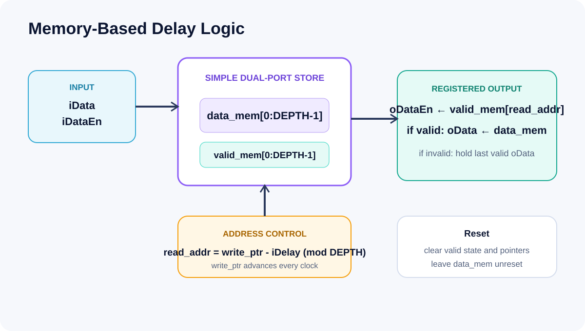

# Project 3 — Memory-Based File-Driven Verification

This is the featured case study: a circular memory delay DUT connected to a file-driven Input Driver and deterministic Output Checker.




## Problem

Exercise reset, input gating, dynamic delay selection, data/valid comparison, and output-count checking from reproducible scenario files rather than hard-coded stimulus alone.

## Architecture

- simple dual-port memory coding style
- 16-bit `data_mem`, parallel `valid_mem`
- circular `write_ptr`
- read address `(write_ptr - iDelay) mod DEPTH`
- active-low asynchronous reset
- 100 MHz constraint
- `data_mem` is not reset; validity blocks stale data

Project 3 deliberately uses a different invalid-output policy from Projects 1 and 2:

| `oDataEn` | Project 1/2 `oData` | Project 3 `oData` |
|---:|---|---|
| 1 | selected valid sample | selected valid sample |
| 0 | forced to zero | holds the last valid output |

This preserves the supplied reference sequence such as `3, 4, 4, 6, 6, 6, 9`.

## Verification Components

- `tb/input_driver.sv`: parses `Input.txt` and `register.txt`, drives reset, data, valid, and delay events.
- `tb/output_checker.sv`: parses `output.txt`, compares data and valid every checked cycle, checks the valid-output count, and reports error location plus expected/actual values.
- `tb/tb_memory_delay_logic.sv`: connects Driver, DUT, and Checker and emits final `[TEST PASS]` or `[TEST FAIL]`.
- `+SCENARIO=1|2|3`: selects the vector directory.

`register.txt` retains `Config1..4`, `Pilot_mode`, and `Ctrl_Option` for format compatibility. This environment actively consumes only `Delay` and optional `DelayAt` entries.

## Scenarios

| Scenario | Focus | Reference cycles | Valid outputs |
|---|---|---:|---:|
| 1 | reset release, `iDelay=3`, data 10..50 | 8 | 5 |
| 2 | `iDelay=5`, sparse valid pattern | 14 | 4 |
| 3 | `iDelay` changes 3→5 at input cycle 7 | 17 | 14 |

Dynamic tap selection can revisit earlier memory slots; repeated values around the transition are therefore expected and explicitly represented in `output.txt`.

## Validation Status

| Evidence state | Result |
|---|---|
| Source and scenario files | Documented |
| Python reference-vector consistency | **REFERENCE PASS** for all 3 scenarios |
| DUT + Checker Icarus Verilog 13.0 simulation | **PASS** for scenarios 1–3 |
| Quartus synthesis | **BLOCKED — Quartus unavailable** |

The exact executed console logs, checker logs, and VCD files are committed in [`results/`](results/). Reference-only evidence remains separately available in [reference_validation.txt](results/reference_validation.txt) and [reference_summary.csv](results/reference_summary.csv).

## Reproduce

Reference vectors:

```text
python scripts/generate_reference_vectors.py
```

Executed portable flow, from the repository root:

```powershell
powershell -NoProfile -ExecutionPolicy Bypass -File .\scripts\run_project3.ps1
```

A successful local run must show both markers for each scenario:

```text
[CHECKER][PASS]
[TEST PASS]
```

Quartus, from `03_memory_based_dv/quartus`:

```bat
run_quartus_compile.bat
```

## Limitations

- The committed simulation evidence uses Icarus Verilog 13.0; no ModelSim/Questa PASS is claimed.
- The Python generator validates the reference model and vectors, while the Icarus regression separately executes SystemVerilog.
- Memory inference and timing depend on Quartus, device support, and the final Fit report.
