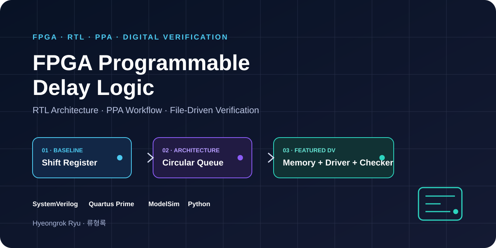
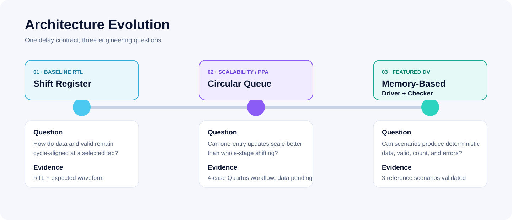

<p align="center">
  
</p>

# FPGA Programmable Delay Logic

**RTL Architecture · PPA · File-Driven Verification**  
Shift Register → Circular Queue → Memory-Based DV

[English README](README.md) · [기술 포트폴리오 페이지](https://tontonjeong.github.io/fpga-delay-logic-design-verification/) · [검증 근거 표](docs/evidence-matrix.md)

## 프로젝트 개요

하나의 programmable delay 문제를 세 단계로 발전시킨 FPGA RTL/DV 포트폴리오입니다.

1. **Shift Register Baseline** — data와 valid를 같은 깊이로 이동하고 `iDelay` tap을 선택합니다.
2. **Circular Queue and PPA** — 매 클록 한 entry만 갱신하고 `(write_ptr-iDelay) mod DEPTH`로 읽습니다.
3. **Memory-Based File-Driven DV** — tagged vector를 읽는 Input Driver, DUT, data/valid/count를 확인하는 Output Checker를 구성합니다.

Project 3을 대표 사례로 배치하되 Architecture Evolution은 1→2→3 순서를 유지합니다.

## 핵심 수치

| 항목 | 범위 |
|---|---|
| Architecture | 3단계 |
| Verification Scenario | 3개 |
| PPA Configuration | 4개 |
| Clock Constraint | 100 MHz |
| Verification Style | File-driven Driver and Checker |

## 검증 상태를 구분하는 기준

| 상태 | 의미 |
|---|---|
| Documented | 구조와 사양이 소스·문서에 존재 |
| Reference Validated | Python reference vector 내부 일관성 확인 |
| Simulation Verified | ModelSim에서 DUT와 Checker를 실행해 PASS |
| Synthesized / PPA Analyzed | Quartus Full Compilation과 Power Analyzer 실행 |

현재 Project 3의 세 시나리오는 **Reference Validated** 상태입니다. ModelSim과 Quartus는 포트폴리오 구성 환경에 설치되어 있지 않아 실행 결과를 주장하지 않습니다.

## Architecture Evolution



### Project 1 — Shift Register Baseline

- 16-bit data, DEPTH 10
- `data_shift`와 `enable_shift` 동기 이동
- `iDelay=N` tap 선택
- invalid output은 `oDataEn=0`, `oData=0`
- 자동 checker가 아닌 expected waveform eye-checking

[상세 보기](01_shift_register_baseline/README.md)

### Project 2 — Circular Queue and PPA

- circular `write_ptr`
- `read_ptr=(write_ptr-iDelay) mod DEPTH`
- data array는 reset하지 않고 valid state로 stale data 차단
- Shift/Circular × DEPTH 10/100의 네 Quartus 구성
- report parser와 chart gate 구현

현재 상태: **PPA automation implemented · Local Quartus execution required · Numerical PPA results pending**

[상세 보기](02_circular_queue_ppa/README.md)

### Project 3 — Memory-Based File-Driven DV

- `Input.txt`: `iData`, `iDataEn`
- `register.txt`: 초기 `Delay`, 선택적 `DelayAt`
- `output.txt`: expected `oData`, `oDataEn`
- data/valid/count 비교
- 오류 sample, expected, actual 출력

Project 3은 invalid cycle에서 `oDataEn=0`이더라도 `oData`가 마지막 유효값을 유지합니다. Projects 1·2의 zero-fill 정책과 의도적으로 다릅니다.

[상세 보기](03_memory_based_dv/README.md)

## Project 3 Reference 결과

| Scenario | Reference cycle | Valid output | 결과 |
|---:|---:|---:|---|
| 1 | 8 | 5 | REFERENCE PASS |
| 2 | 14 | 4 | REFERENCE PASS |
| 3 | 17 | 14 | REFERENCE PASS |

이 결과는 Python reference-vector consistency이며 DUT ModelSim PASS와 동일하지 않습니다.

## 재현

```text
python 03_memory_based_dv/scripts/generate_reference_vectors.py
python scripts/validate_repository.py
git diff --exit-code
```

상용 도구 실행은 [재현 가이드](docs/reproducibility.md)를 참고하십시오.

## 공개 범위와 한계

- 원본 ZIP/DOCX, 강의자료, 비공개 링크는 커밋하지 않았습니다.
- 예상 파형은 실제 ModelSim capture와 구분합니다.
- 실제 Quartus report가 없어 Fmax, ALM, power, timing closure 수치를 작성하지 않았습니다.
- vectorless power는 보드 실측값이 아닙니다.
- 별도 오픈소스 라이선스를 자동 부여하지 않았습니다.

## 작성자

**Hyeongrok Ryu · 류형록**  
Academic FPGA RTL Design and Verification Project

