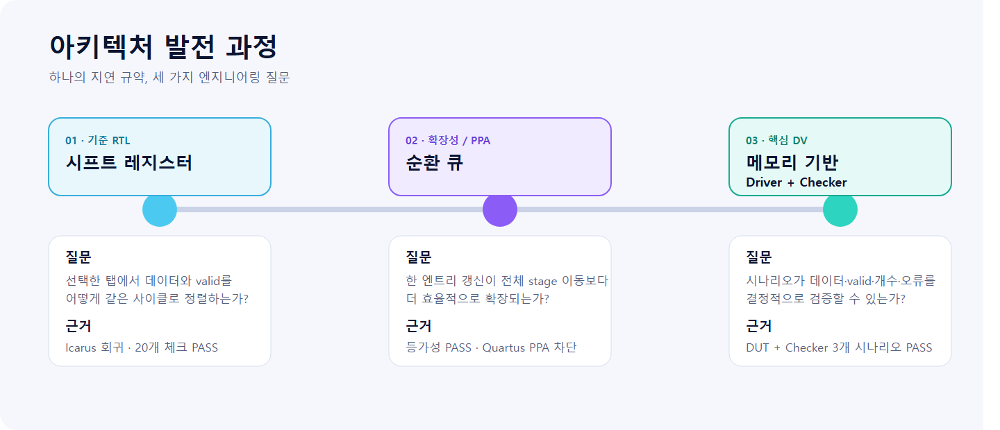
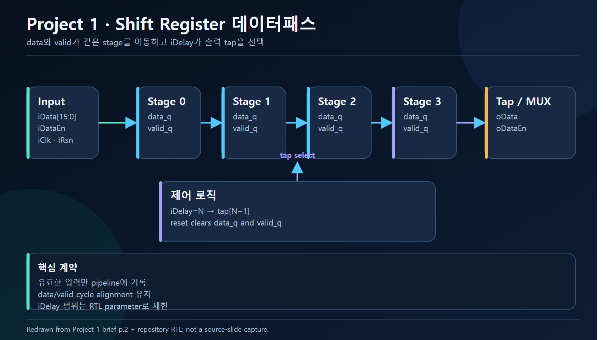
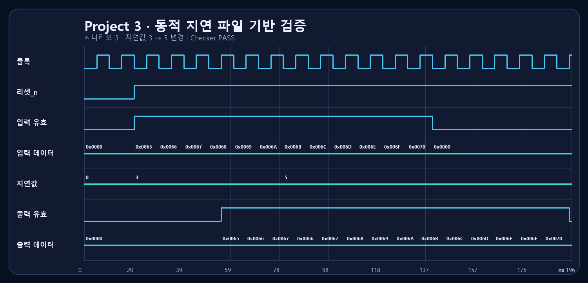
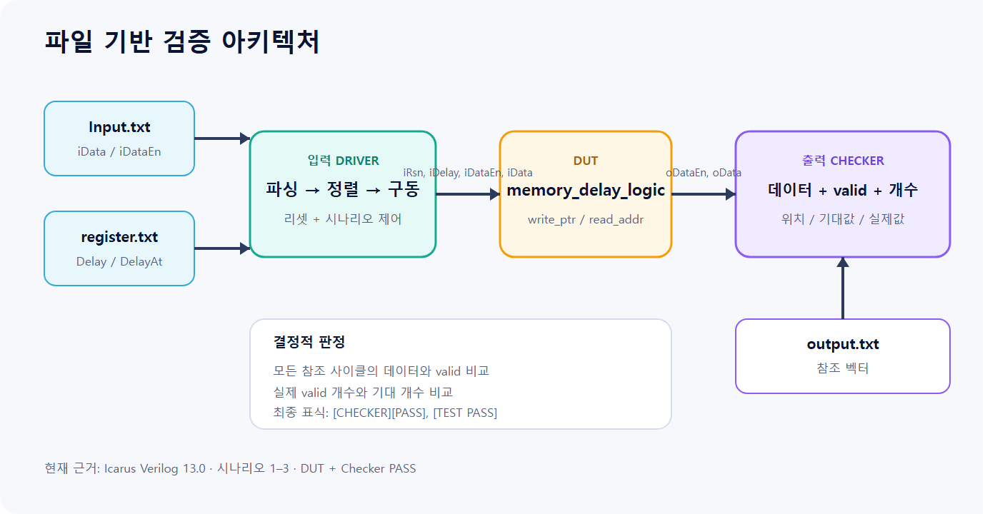

<p align="center">
  
</p>

# FPGA Programmable Delay Logic

[](https://github.com/Tontonjeong/fpga-delay-logic-design-verification/actions/workflows/validate.yml)

**RTL Architecture · PPA Methodology · File-Driven Digital Verification**

Shift Register → Circular Queue → Memory-Based DUT
SystemVerilog · Icarus Verilog 13.0 · Quartus Project Automation · Python

[English README](README.md) · [한국어 Portfolio](https://tontonjeong.github.io/fpga-delay-logic-design-verification/) · [English Portfolio](https://tontonjeong.github.io/fpga-delay-logic-design-verification/en/) · [검증 Manifest](results/verification_summary.json)

## 결과 요약

하나의 programmable delay 규약을 세 단계로 발전시킨 FPGA RTL/DV 포트폴리오입니다.

1. **Shift Register Baseline** — data와 valid를 같은 깊이로 이동하고 `iDelay-1` 탭을 선택합니다.
2. **Circular Queue and PPA** — 매 클록 한 entry만 갱신하고 모듈로 읽기 주소를 계산합니다.
3. **Memory-Based File-Driven DV** — Input Driver, DUT, Output Checker로 data·valid·출력 개수를 검증합니다.

2026-07-29~30에 원본 ZIP을 ModelSim 10.5b로 먼저 실행하고, 보완
self-check를 Icarus Verilog 13.0으로 실행했습니다. Project 1은 20개
self-check, Project 2는 26개 아키텍처 등가성 체크, Project 3은 파일
시나리오 1–3에서 모두 PASS했습니다. 원본 TB의 한계와 호환성 수정은
[source provenance](docs/source-provenance.md)에 별도로 기록했습니다.

Quartus Prime Pro 24.3.1로 Project 1·3 합성과 Project 2의 네 가지
Fit/Timing/Power 구성을 실제 실행했습니다. Project 2 결과는 예상과
달리 Circular Queue가 RAM으로 추론되지 않았고, 100단에서 레지스터는
7.4% 줄었지만 ALM은 19.6% 늘고 제한 Fmax는 38.1% 낮았습니다.

## 핵심 수치

| 항목 | 실행 또는 문서 근거 |
|---|---|
| Architecture | 3단계: Shift Register, Circular Queue, Memory-Based DV |
| Functional Regression | 3/3 프로젝트 PASS |
| Self-check | Project 1 20개 + Project 2 26개 |
| File-driven DV | Project 3 3개 시나리오, 8/14/17 cycle 비교 |
| PPA Execution | Quartus 24.3.1, 동일 조건 4개 Fit/Timing/Power 완료 |
| Evidence | compile/simulation log, VCD, 파형 PNG, JSON manifest |

## Architecture Evolution

<picture>
  <source srcset="docs/assets/ko/architecture/architecture_evolution.svg" type="image/svg+xml">
  
</picture>

| 단계 | 엔지니어링 초점 | 현재 근거 |
|---|---|---|
| [01 — Shift Register Baseline](01_shift_register_baseline/README.md) | cycle semantics, data/valid 정렬 | **PASS**, 20 checks, log + VCD |
| [02 — Circular Queue and PPA](02_circular_queue_ppa/README.md) | one-slot update, pointer wrap, 규모 비교 | **PASS**, 26 equivalence checks, log + VCD |
| [03 — Memory-Based File-Driven DV](03_memory_based_dv/README.md) | Driver/Checker, 동적 delay event | **PASS**, scenario 1–3, logs + VCD |

## 과제 브리프 재도식화

강의자료 5페이지를 해석해 한·영 8종 엔지니어링 구조도로 새로 그렸습니다. 원본 슬라이드 이미지는 공개하지 않았으며, 그림별 출처 매핑과 증거 경계는 [provenance manifest](docs/assets/architecture/diagram_provenance.yaml)에 기록했습니다.

<picture>
  <source srcset="docs/assets/ko/architecture/project1_shift_register_datapath.svg" type="image/svg+xml">
  
</picture>

| Project | 검토용 구조도 |
|---|---|
| 1 | [데이터패스](docs/assets/ko/architecture/project1_shift_register_datapath.svg) · [self-checking TB](docs/assets/ko/architecture/project1_testbench_architecture.svg) · [예상 timing](docs/assets/ko/architecture/project1_expected_timing.svg) |
| 2 | [순환 큐](docs/assets/ko/architecture/project2_circular_queue_architecture.svg) · [아키텍처 비교](docs/assets/ko/architecture/project2_architecture_comparison.svg) · [통제 PPA matrix](docs/assets/ko/architecture/project2_ppa_matrix.svg) |
| 3 | [파일 기반 검증](docs/assets/ko/architecture/project3_file_driven_verification.svg) · [시나리오 실행 흐름](docs/assets/ko/architecture/project3_scenario_flow.svg) |

## 검증 상태

| Project | 기능 시뮬레이션 | 합성 | 수치 PPA | 근거 |
|---|---|---|---|---|
| Project 1 | **PASS** — 보완 self-check 20개 | **SUCCESS** — 85 ALM estimate, 119 registers | N/A | [원본/보완 경계](docs/source-provenance.md), [synthesis](01_shift_register_baseline/quartus/output_files/delay_logic.syn.summary) |
| Project 2 | **PASS** — 두 구현 + 독립 참조, 26 checks | **SUCCESS** — 4개 Fit | **COMPLETE** — timing/power 포함 | [CSV](02_circular_queue_ppa/results/PPA_results.csv), [raw reports](02_circular_queue_ppa/quartus/) |
| Project 3 | **PASS** — 1줄 호환 패치 후 원본 Checker 3개 시나리오 | **SUCCESS** — `altdpram` LUTRAM 추론 | N/A | [archive rerun](results/archive_rerun/), [synthesis](03_memory_based_dv/quartus/output_files/memory_delay_logic.syn.rpt) |

Project 3 실제 실행 결과:

| Scenario | 비교 cycle | Valid output | 결과 |
|---:|---:|---:|---|
| 1 | 8 | 5 | `[CHECKER][PASS]` + `[TEST PASS]` |
| 2 | 14 | 4 | `[CHECKER][PASS]` + `[TEST PASS]` |
| 3 | 17 | 14 | `[CHECKER][PASS]` + `[TEST PASS]` |

## 실제 실행 파형

<p align="center">
  
</p>

파형 PNG는 예상값을 다시 그린 그림이 아니라 커밋된 VCD에서 직접 렌더링했습니다. Project 1·2 파형은 [한국어 포트폴리오](https://tontonjeong.github.io/fpga-delay-logic-design-verification/)에서 함께 확인할 수 있습니다.

## 파일 기반 검증 구조

<picture>
  <source srcset="docs/assets/ko/verification/file_driven_dv_flow.svg" type="image/svg+xml">
  
</picture>

Checker는 모든 참조 cycle의 data와 valid를 비교하고 실제 valid 출력 개수를 계산합니다. 오류가 있으면 sample 위치, 기대값, 실제값을 기록하며 최종 verdict를 차단합니다.

## PPA 경계


Agilex 5 `A5ED065BB32AE6SR0`, 100 MHz, `BALANCED`, virtual pin,
고정 12.5% toggle 가정으로 네 구성을 실행했습니다. Quartus 24.3과
Agilex 5 조합에서 vectorless estimation이 지원되지 않아 모든 케이스에
동일하게 `vectorless=off`를 적용했습니다.

| Architecture | DEPTH | ALM | Register | Restricted Fmax | Setup slack | Dynamic power |
|---|---:|---:|---:|---:|---:|---:|
| Shift Register | 10 | 113 | 175 | 554.02 MHz | 9.098 ns | 0.737 W |
| Circular Queue | 10 | 162 | 178 | 536.48 MHz | 8.136 ns | 0.737 W |
| Shift Register | 100 | 925 | 1851 | 554.02 MHz | 8.800 ns | 0.742 W |
| Circular Queue | 100 | 1106 | 1714 | 343.05 MHz | 7.085 ns | 0.744 W |

두 Circular Queue 모두 RAM block은 0개였습니다. 전력값은 Low-confidence
활동률 기반 추정치이며 보드 실측이 아닙니다. 상세 해석과 raw report는
[Project 2](02_circular_queue_ppa/README.md)에 있습니다.

## 재현

Icarus Verilog 13.0을 설치한 Windows PowerShell에서 저장소 루트 기준으로 실행합니다.

```powershell
powershell -NoProfile -ExecutionPolicy Bypass -File .\scripts\run_all_verification.ps1
```

세 프로젝트를 다시 컴파일·실행하고 로그, VCD, JSON manifest를 생성합니다. 세부 전제조건은 [재현 가이드](docs/reproducibility.md)를 참고하십시오.

## 공개 근거 원칙

- PASS는 실제 실행 로그에 해당 marker가 있을 때만 표시합니다.
- 리뷰 가능한 VCD와 파형 PNG를 함께 유지합니다.
- Icarus의 constant-select sensitivity 메시지는 비치명 경고이며 모든 checker가 error 0으로 종료했습니다.
- 합성, Fit, Timing, Power 상태는 raw report가 있을 때만 완료로 표시합니다.
- 고정 toggle 기반 power는 Low-confidence 도구 추정이며 보드 실측값이 아닙니다.

## 작성자

**Hyeongrok Ryu · 류형록**  
FPGA RTL Design and Digital Verification Portfolio
