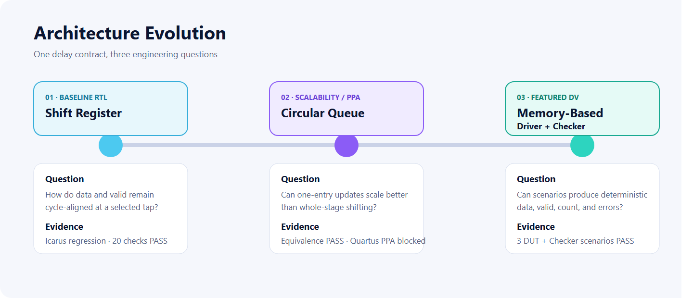
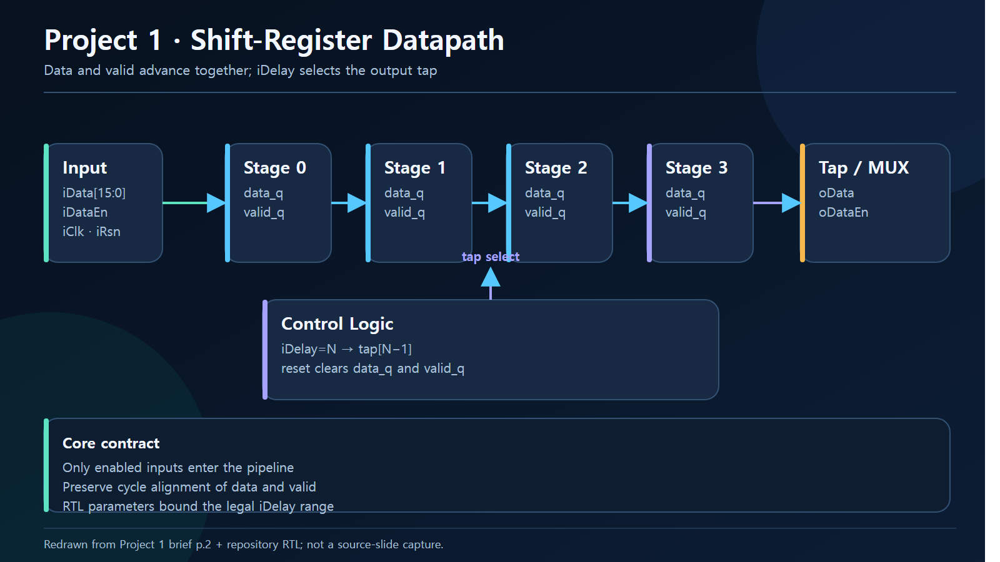
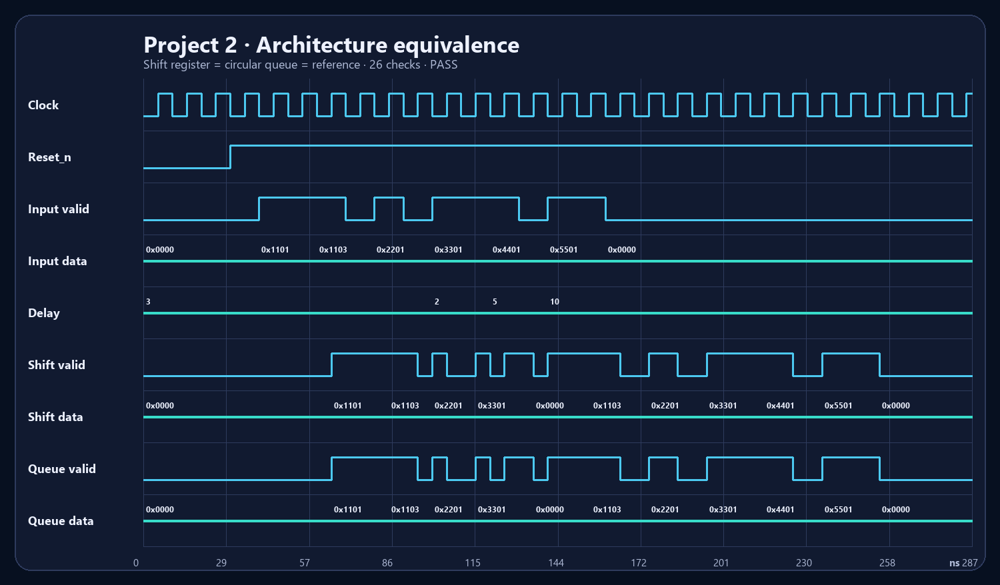
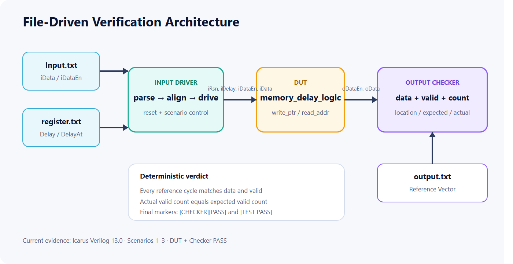

<p align="center">
  
</p>

# FPGA Programmable Delay Logic

[](https://github.com/Tontonjeong/fpga-delay-logic-design-verification/actions/workflows/validate.yml)

**RTL Architecture · PPA Methodology · File-Driven Digital Verification**

Shift Register → Circular Queue → Memory-Based DUT
SystemVerilog · Icarus Verilog 13.0 · Quartus Project Automation · Python

[한국어 README](README.ko.md) · [한국어 Portfolio](https://tontonjeong.github.io/fpga-delay-logic-design-verification/) · [English Portfolio](https://tontonjeong.github.io/fpga-delay-logic-design-verification/en/) · [Evidence Manifest](results/verification_summary.json)

## Outcome

One programmable-delay contract is developed through three engineering stages:

1. a parameterized shift-register baseline with aligned data/valid pipelines;
2. a circular queue using one-slot writes and modulo read addressing;
3. a memory-based DUT with file-driven stimulus and a deterministic Output Checker.

The supplied ZIP sources were first rerun with ModelSim 10.5b, then separate
self-checking regressions were executed with Icarus Verilog 13.0. Project 1
passed 20 supplemental checks, Project 2 passed 26 architecture-equivalence
checks, and Project 3 passed all three original Driver/Checker scenarios after
a documented one-line instance-name compatibility change.

Quartus Prime Pro 24.3.1 then executed Project 1/3 synthesis and the complete
four-case Project 2 Fit/Timing/Power matrix. The measured result does not support
a blanket queue-optimization claim: at depth 100 the Circular Queue uses 7.4%
fewer registers, but 19.6% more ALMs and has 38.1% lower restricted Fmax.

## Recruiter Snapshot

| Signal | Executed or documented evidence |
|---|---|
| Architecture progression | 3 stages: shift register, circular queue, memory-based DV |
| Functional regression | 3/3 projects PASS using Icarus Verilog 13.0 |
| Self-check coverage | 20 Project 1 checks + 26 Project 2 equivalence checks |
| File-driven DV | 3 Project 3 scenarios; 8/14/17 checked cycles |
| PPA execution | 4 equally constrained Quartus 24.3.1 Fit/Timing/Power runs |
| Evidence | compile logs, simulation logs, VCDs, rendered waveforms, JSON manifest |

## Architecture Evolution

<picture>
  <source srcset="docs/assets/en/architecture/architecture_evolution.svg" type="image/svg+xml">
  
</picture>

| Stage | Engineering focus | Current evidence |
|---|---|---|
| [01 — Shift Register Baseline](01_shift_register_baseline/README.md) | cycle semantics and aligned data/valid pipelines | **PASS**, 20 checks, log + VCD |
| [02 — Circular Queue and PPA](02_circular_queue_ppa/README.md) | one-slot updates, pointer wrap, scale study | **PASS**, 26 equivalence checks, log + VCD |
| [03 — Memory-Based File-Driven DV](03_memory_based_dv/README.md) | reusable Driver/Checker, dynamic delay events | **PASS**, scenarios 1–3, logs + VCD |

## Project-Brief Redraws

The five source-brief pages were interpreted and redrawn as eight bilingual engineering diagrams. No source-slide image is published; the redraw-to-source mapping and evidence boundaries are recorded in the [provenance manifest](docs/assets/architecture/diagram_provenance.yaml).

<picture>
  <source srcset="docs/assets/en/architecture/project1_shift_register_datapath.svg" type="image/svg+xml">
  
</picture>

| Project | Review diagrams |
|---|---|
| 1 | [datapath](docs/assets/en/architecture/project1_shift_register_datapath.svg) · [self-checking testbench](docs/assets/en/architecture/project1_testbench_architecture.svg) · [expected timing](docs/assets/en/architecture/project1_expected_timing.svg) |
| 2 | [circular queue](docs/assets/en/architecture/project2_circular_queue_architecture.svg) · [architecture comparison](docs/assets/en/architecture/project2_architecture_comparison.svg) · [controlled PPA matrix](docs/assets/en/architecture/project2_ppa_matrix.svg) |
| 3 | [file-driven verification](docs/assets/en/architecture/project3_file_driven_verification.svg) · [scenario flow](docs/assets/en/architecture/project3_scenario_flow.svg) |

## Validation Status

| Project | Functional simulation | Synthesis | Numerical PPA | Evidence |
|---|---|---|---|---|
| Project 1 | **PASS** — 20 supplemental checks | **SUCCESS** — 85 estimated ALMs, 119 registers | N/A | [source boundary](docs/source-provenance.md), [synthesis](01_shift_register_baseline/quartus/output_files/delay_logic.syn.summary) |
| Project 2 | **PASS** — 2 implementations + independent reference, 26 checks | **SUCCESS** — four Fits | **COMPLETE** — timing and power included | [CSV](02_circular_queue_ppa/results/PPA_results.csv), [raw reports](02_circular_queue_ppa/quartus/) |
| Project 3 | **PASS** — original Checker after one-line compatibility change | **SUCCESS** — `altdpram` inferred as LUTRAM | N/A | [archive rerun](results/archive_rerun/), [synthesis](03_memory_based_dv/quartus/output_files/memory_delay_logic.syn.rpt) |

Project 3 executed results:

| Scenario | Compared cycles | Valid outputs | Result |
|---:|---:|---:|---|
| 1 | 8 | 5 | `[CHECKER][PASS]` + `[TEST PASS]` |
| 2 | 14 | 4 | `[CHECKER][PASS]` + `[TEST PASS]` |
| 3 | 17 | 14 | `[CHECKER][PASS]` + `[TEST PASS]` |

## Executed Waveforms

<p align="center">
  
</p>

The PNGs above are rendered from committed VCD files, not reconstructed expected behavior. Additional Project 1 and Project 3 waveforms are shown on the [English portfolio](https://tontonjeong.github.io/fpga-delay-logic-design-verification/en/).

## File-Driven Verification

<picture>
  <source srcset="docs/assets/en/verification/file_driven_dv_flow.svg" type="image/svg+xml">
  
</picture>

The Checker compares data and valid on every reference cycle, counts valid outputs, reports sample position plus expected/actual values on mismatch, and gates the final test verdict.

## PPA Boundary


The study targets Agilex 5 `A5ED065BB32AE6SR0`, 100 MHz, `BALANCED`
optimization, virtual pins, and one fixed 12.5% default-toggle assumption.
Quartus 24.3 reports vectorless estimation as unsupported for Agilex 5, so all
four cases use `vectorless=off`.

| Architecture | DEPTH | ALMs | Registers | Restricted Fmax | Setup slack | Dynamic power |
|---|---:|---:|---:|---:|---:|---:|
| Shift Register | 10 | 113 | 175 | 554.02 MHz | 9.098 ns | 0.737 W |
| Circular Queue | 10 | 162 | 178 | 536.48 MHz | 8.136 ns | 0.737 W |
| Shift Register | 100 | 925 | 1851 | 554.02 MHz | 8.800 ns | 0.742 W |
| Circular Queue | 100 | 1106 | 1714 | 343.05 MHz | 7.085 ns | 0.744 W |

Both Circular Queue cases report zero RAM blocks. Power confidence is Low and
the values are tool estimates, not board measurements.

Read the [PPA methodology](docs/ppa-methodology.md).

## Reproduce

Install Icarus Verilog 13.0, then run from the repository root:

```powershell
powershell -NoProfile -ExecutionPolicy Bypass -File .\scripts\run_all_verification.ps1
```

This compiles all three projects and regenerates logs, VCD files, and the evidence manifest. See [reproducibility](docs/reproducibility.md) for prerequisites and individual commands.

## Repository Structure

```text
.
├── 01_shift_register_baseline/   # RTL, self-checking regression, log, VCD
├── 02_circular_queue_ppa/        # two RTL architectures, equivalence, PPA projects
├── 03_memory_based_dv/           # DUT, Driver, Checker, scenarios, logs, VCD
├── docs/                         # Korean/English GitHub Pages + localized assets
├── results/                      # environment scan and evidence manifest
├── scripts/                      # regression, collection, rendering, Pages validation
└── .github/workflows/            # repository checks
```

## Evidence Rules

- A PASS label requires an executed log with the expected marker.
- VCD and waveform PNG files are retained for review.
- The Icarus constant-select sensitivity message is a non-fatal simulator limitation; all checks completed with zero errors.
- Synthesis, Fit, timing, and power are labeled complete only when raw reports exist.
- Fixed-toggle power is a Low-confidence tool estimate, not a board measurement.

## Author

**Hyeongrok Ryu · 류형록**

FPGA RTL Design and Digital Verification Portfolio
