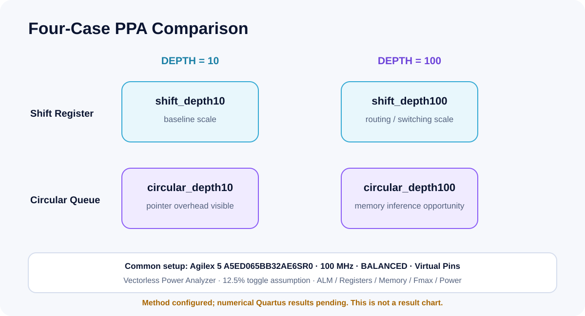

<p align="center">
  
</p>

# FPGA Programmable Delay Logic

**RTL Architecture · PPA · File-Driven Verification**  
Shift Register → Circular Queue → Memory-Based DV  
SystemVerilog / Quartus Prime / ModelSim / Python

[한국어 README](README.ko.md) · [Technical Portfolio](https://tontonjeong.github.io/fpga-delay-logic-design-verification/) · [Validation Matrix](docs/evidence-matrix.md)

## Korean Executive Summary

하나의 programmable delay 문제를 세 단계로 발전시킨 Academic FPGA RTL Design and Verification Project입니다. Project 1은 데이터와 valid를 동일한 shift stage로 이동시키는 기준 RTL, Project 2는 매 클록 한 entry만 갱신하는 circular queue와 4-case PPA 자동화, Project 3은 파일 기반 Input Driver와 Output Checker를 포함한 self-checking DV 환경입니다.

포트폴리오는 실행 증거를 네 단계로 구분합니다: **Documented**, **Reference Validated**, **Simulation Verified**, **Synthesized / PPA Analyzed**. 현재 공개 환경에서 확인된 정량 결과는 Project 3의 Python reference-vector consistency뿐입니다. ModelSim 및 Quartus 결과는 상용 도구가 없는 환경에서 실행한 것처럼 표시하지 않았습니다.

## English Technical Summary

This portfolio follows one programmable-delay contract through three engineering stages:

1. a parameterized shift-register baseline that aligns data and valid paths;
2. a circular queue that replaces whole-array shifting with one-slot writes and enables a controlled PPA comparison;
3. a memory-based DUT with file-driven stimulus, dynamic delay events, deterministic data/valid checks, and valid-output count checking.

The public repository separates structural expectations from measured evidence. It contains no invented Fmax, utilization, power, timing-closure, or reduction claims.

## Recruiter Snapshot

| Signal | Portfolio evidence |
|---|---|
| Architecture progression | 3 stages: shift register, circular queue, memory-based DV |
| Verification depth | 3 file-driven scenarios with data, valid, count, and location-aware errors |
| PPA scope | 4 identically constrained Quartus configurations |
| Clock target | 100 MHz / 10 ns SDC |
| Automation | Reference generation, report parsing, chart gating, repository CI |
| Design discipline | Data/valid alignment, modulo addressing, reset policy, explicit output semantics |

## Architecture Evolution

<p align="center">
  
</p>

The three directories are one development narrative, not unrelated assignments:

| Stage | Engineering focus | Public evidence |
|---|---|---|
| [01 — Shift Register Baseline](01_shift_register_baseline/README.md) | cycle semantics and aligned data/valid pipelines | RTL, testbench, 100 MHz SDC, expected waveform |
| [02 — Circular Queue and PPA](02_circular_queue_ppa/README.md) | circular addressing, reset policy, scale study | two architectures, four Quartus projects, report collector |
| [03 — Memory-Based File-Driven DV](03_memory_based_dv/README.md) | reusable Driver/Checker architecture | DUT, Driver, Checker, vectors, reference PASS evidence |

## Three Project Cards

### 01 · Shift Register Baseline

- Basic programmable-delay RTL
- parallel `data_shift` and `enable_shift`
- runtime tap selection
- manual waveform eye-checking

### 02 · Circular Queue and PPA

- one-entry update per clock
- `write_ptr` wrap and modulo read address
- DEPTH 10/100 scalability study
- automated Quartus report collection

### 03 · Memory-Based File-Driven DV

- tagged `Input.txt`, `register.txt`, and `output.txt`
- Input Driver and Output Checker
- cycle-by-cycle data and valid comparison
- valid-output count verification
- scenario logs with deterministic PASS/FAIL markers

## Key Engineering Decisions

| Decision | Rationale | Observable behavior |
|---|---|---|
| Shift data and valid together | preserve cycle alignment | selected tap drives `oData` and `oDataEn` together |
| Do not reset memory data arrays | reduce reset network and preserve inference opportunity | reset validity prevents stale data from becoming valid |
| Validate delay range | prevent invalid addressing | Projects 2/3 accept only `1..DEPTH` |
| Keep per-project output semantics | preserve authored interface contracts | Projects 1/2 zero invalid data; Project 3 holds the last valid value |
| Separate reference from DUT evidence | avoid overstating verification | Python REFERENCE PASS is not ModelSim PASS |
| Gate charts on complete CSV data | prevent fabricated visuals | no numerical PPA chart is committed without four complete result rows |

More detail: [design decisions](docs/design-decisions.md).

## Validation Status

| Project | RTL Source | Simulation | Synthesis | PPA | Evidence |
|---|---|---|---|---|---|
| Project 1 | Supplied source, public copy reviewed | Not rerun; expected waveform only | Not rerun | N/A | source, SDC, expected-cycle table |
| Project 2 | Supplied source, public copy reviewed | Not rerun | Not rerun | Automation ready; numbers pending | four QSF projects, collector, blank template |
| Project 3 | Supplied source, public copy reviewed | Not run; ModelSim required | Not rerun | N/A | 3-scenario **Reference Validated** |

Project 3 committed reference evidence:

| Scenario | Reference cycles | Expected valid outputs | Result |
|---:|---:|---:|---|
| 1 | 8 | 5 | REFERENCE PASS |
| 2 | 14 | 4 | REFERENCE PASS |
| 3 | 17 | 14 | REFERENCE PASS |

See [validation status](docs/validation-status.md) and [evidence matrix](docs/evidence-matrix.md).

## PPA Results

<p align="center">
  
</p>

**PPA automation implemented · Local Quartus execution required · Numerical PPA results pending**

The study targets Agilex 5 `A5ED065BB32AE6SR0` with a 100 MHz constraint, `BALANCED` optimization, virtual pins, vectorless Power Analyzer, and a 12.5% default toggle assumption. `PPA_results_template.csv` has blank metric cells by design. No bar chart or reduction claim is published until complete Fit, Timing, and Power reports exist.

Read the [PPA methodology](docs/ppa-methodology.md).

## Verification Architecture

<p align="center">
  
</p>

The Checker compares every expected data and valid cycle, counts actual valid outputs, and reports the sample index plus expected/actual values on errors. A successful ModelSim run must emit both `[CHECKER][PASS]` and `[TEST PASS]`; this repository does not claim those markers were produced locally.

Read the [verification strategy](docs/verification-strategy.md).

## Repository Structure

```text
.
├── 01_shift_register_baseline/   # Baseline RTL and expected waveform
├── 02_circular_queue_ppa/        # Circular queue + 4-case Quartus workflow
├── 03_memory_based_dv/           # Featured DUT / Driver / Checker / vectors
├── assets/                       # SVG architecture, verification, hero, PPA
├── docs/                         # GitHub Pages and engineering notes
├── scripts/                      # Public consistency validation
└── .github/workflows/            # Open CI without commercial FPGA tools
```

## Quick Start

Run the open, tool-independent checks:

```text
python 03_memory_based_dv/scripts/generate_reference_vectors.py
python scripts/validate_repository.py
git diff --exit-code
```

Run ModelSim locally:

```bat
01_shift_register_baseline\modelsim\run_modelsim_batch.bat
02_circular_queue_ppa\modelsim\run_modelsim_batch.bat
03_memory_based_dv\modelsim\run_all_batch.bat
```

Run the four-case PPA flow from a Quartus Prime Pro command prompt:

```bat
02_circular_queue_ppa\scripts\run_all_ppa.bat
```

Detailed prerequisites and working directories are in [reproducibility](docs/reproducibility.md).

## Evidence and Limitations

- Original ZIP and DOCX files are excluded from version control.
- Expected waveform figures are explicitly labeled and are not ModelSim captures.
- Project 3 reference consistency uses Python-generated vectors; it does not execute the SystemVerilog DUT.
- Quartus Fit/Timing/Power reports are absent, so synthesis, timing closure, memory inference, and numerical PPA are not claimed.
- Power methodology is vectorless estimation, not measured board power.
- GitHub CI validates repository consistency and reference vectors only. Quartus synthesis and ModelSim simulation require a licensed local environment.

See [limitations](docs/limitations.md) and [provenance](01_shift_register_baseline/PROVENANCE.md).

## Author

**Hyeongrok Ryu · 류형록**

Academic FPGA RTL Design and Verification Project.

