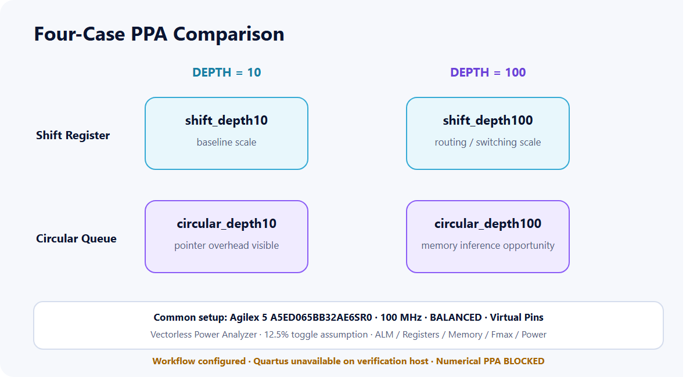

<p align="center">
  
</p>

# FPGA Programmable Delay Logic

**RTL Architecture · PPA Methodology · File-Driven Digital Verification**

Shift Register → Circular Queue → Memory-Based DUT
SystemVerilog · Icarus Verilog 13.0 · Quartus Project Automation · Python

[한국어 README](README.ko.md) · [한국어 Portfolio](https://tontonjeong.github.io/fpga-delay-logic-design-verification/) · [English Portfolio](https://tontonjeong.github.io/fpga-delay-logic-design-verification/en/) · [Evidence Manifest](results/verification_summary.json)

## Outcome

One programmable-delay contract is developed through three engineering stages:

1. a parameterized shift-register baseline with aligned data/valid pipelines;
2. a circular queue using one-slot writes and modulo read addressing;
3. a memory-based DUT with file-driven stimulus and a deterministic Output Checker.

All three projects were compiled and executed on 2026-07-29 with **Icarus Verilog 13.0**. Project 1 passed 20 self-checks, Project 2 passed 26 architecture-equivalence checks, and all three Project 3 file scenarios emitted both `[CHECKER][PASS]` and `[TEST PASS]`.

Quartus was not installed on the verification host. Synthesis and numerical PPA are therefore labeled **BLOCKED**, not estimated.

## Recruiter Snapshot

| Signal | Executed or documented evidence |
|---|---|
| Architecture progression | 3 stages: shift register, circular queue, memory-based DV |
| Functional regression | 3/3 projects PASS using Icarus Verilog 13.0 |
| Self-check coverage | 20 Project 1 checks + 26 Project 2 equivalence checks |
| File-driven DV | 3 Project 3 scenarios; 8/14/17 checked cycles |
| PPA scope | 4 equally constrained Quartus projects at DEPTH 10/100 |
| Evidence | compile logs, simulation logs, VCDs, rendered waveforms, JSON manifest |

## Architecture Evolution

<picture>
  <source srcset="docs/assets/en/architecture/architecture_evolution.svg" type="image/svg+xml">
  
</picture>

| Stage | Engineering focus | Current evidence |
|---|---|---|
| [01 — Shift Register Baseline](01_shift_register_baseline/README.md) | cycle semantics and aligned data/valid pipelines | **PASS**, 20 checks, log + VCD |
| [02 — Circular Queue and PPA](02_circular_queue_ppa/README.md) | one-slot updates, pointer wrap, scale study | **PASS**, 26 equivalence checks, log + VCD |
| [03 — Memory-Based File-Driven DV](03_memory_based_dv/README.md) | reusable Driver/Checker, dynamic delay events | **PASS**, scenarios 1–3, logs + VCD |

## Validation Status

| Project | Functional simulation | Synthesis | Numerical PPA | Evidence |
|---|---|---|---|---|
| Project 1 | **PASS** — Icarus 13.0, 20 checks | **BLOCKED** — Quartus unavailable | N/A | [log](01_shift_register_baseline/results/project1_simulation.log), [VCD](01_shift_register_baseline/results/project1_waveform.vcd) |
| Project 2 | **PASS** — 2 implementations + independent reference, 26 checks | **BLOCKED** — Quartus unavailable | **BLOCKED** — no Fit/Timing/Power reports | [log](02_circular_queue_ppa/results/project2_simulation.log), [VCD](02_circular_queue_ppa/results/project2_waveform.vcd) |
| Project 3 | **PASS** — scenarios 1–3, DUT + Checker | **BLOCKED** — Quartus unavailable | N/A | [results](03_memory_based_dv/results/), [manifest](results/verification_summary.json) |

Project 3 executed results:

| Scenario | Compared cycles | Valid outputs | Result |
|---:|---:|---:|---|
| 1 | 8 | 5 | `[CHECKER][PASS]` + `[TEST PASS]` |
| 2 | 14 | 4 | `[CHECKER][PASS]` + `[TEST PASS]` |
| 3 | 17 | 14 | `[CHECKER][PASS]` + `[TEST PASS]` |

The source implementation tested by the evidence run is commit `c356ade3998e36a76255b573aa9f93bbf274be3e`.

## Executed Waveforms

<p align="center">
  
</p>

The PNGs above are rendered from committed VCD files, not reconstructed expected behavior. Additional Project 1 and Project 3 waveforms are shown on the [English portfolio](https://tontonjeong.github.io/fpga-delay-logic-design-verification/en/).

## File-Driven Verification

<picture>
  <source srcset="docs/assets/en/verification/file_driven_dv_flow.svg" type="image/svg+xml">
  
</picture>

The Checker compares data and valid on every reference cycle, counts valid outputs, reports sample position plus expected/actual values on mismatch, and gates the final test verdict.

## PPA Boundary

<picture>
  <source srcset="docs/assets/en/ppa/ppa_comparison_matrix.svg" type="image/svg+xml">
  
</picture>

The configured study targets Agilex 5 `A5ED065BB32AE6SR0`, 100 MHz, `BALANCED` optimization, virtual pins, vectorless Power Analyzer, and a 12.5% toggle assumption. The host scan found no Quartus executables, so utilization, Fmax, timing closure, power, and architecture-advantage numbers are not claimed.

Read the [PPA methodology](docs/ppa-methodology.md).

## Reproduce

Install Icarus Verilog 13.0, then run from the repository root:

```powershell
powershell -NoProfile -ExecutionPolicy Bypass -File .\scripts\run_all_verification.ps1
```

This compiles all three projects and regenerates logs, VCD files, and the evidence manifest. See [reproducibility](docs/reproducibility.md) for prerequisites and individual commands.

## Repository Structure

```text
.
├── 01_shift_register_baseline/   # RTL, self-checking regression, log, VCD
├── 02_circular_queue_ppa/        # two RTL architectures, equivalence, PPA projects
├── 03_memory_based_dv/           # DUT, Driver, Checker, scenarios, logs, VCD
├── docs/                         # Korean/English GitHub Pages + localized assets
├── results/                      # environment scan and evidence manifest
├── scripts/                      # regression, collection, rendering, Pages validation
└── .github/workflows/            # repository checks
```

## Evidence Rules

- A PASS label requires an executed log with the expected marker.
- VCD and waveform PNG files are retained for review.
- The Icarus constant-select sensitivity message is a non-fatal simulator limitation; all checks completed with zero errors.
- Synthesis and numerical PPA remain BLOCKED until Quartus Fit, Timing, and Power reports exist.
- Vectorless power, if later generated, is an estimate rather than board measurement.

## Author

**Hyeongrok Ryu · 류형록**

FPGA RTL Design and Digital Verification Portfolio
