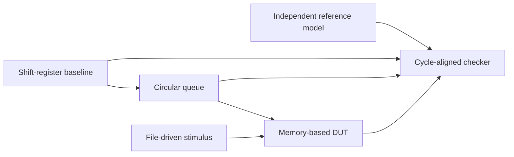

# FPGA Programmable Delay Logic — Research Case Study

> Parameterized RTL · architecture equivalence · reference model · file-driven digital verification

**Portfolio:** https://dororok9061.github.io/projects/fpga-delay-logic/  
**Project Pages:** https://dororok9061.github.io/fpga-delay-logic-design-verification/  
**Repository:** this repository

## Abstract

This project implements one programmable cycle-delay contract through three RTL stages: a parameterized shift-register baseline, a circular queue, and a memory-based DUT with file-driven stimulus and a deterministic checker. The verification path uses an independent reference model rather than comparing one RTL implementation directly against another only.

## Engineering Question

Can multiple RTL architectures preserve the same data/valid latency contract across parameter changes while being checked by a reusable, deterministic verification environment?

## Architecture Evolution



## Methodology

1. Define the programmable delay and aligned data/valid contract.
2. Implement the shift-register baseline.
3. Implement the circular-queue architecture with pointer wrap behavior.
4. Implement the memory-based file-driven DUT/Driver/Checker structure.
5. Compare DUT output against an independent reference model cycle by cycle.
6. Save deterministic logs, VCD waveforms, and machine-readable verification summaries.

## Results

- Project 1: **20/20** Icarus Verilog self-checks passed.
- Project 2: **26/26** architecture-equivalence checks passed.
- Project 3: **3/3** file-driven scenarios passed.
- Functional simulation evidence is committed as logs and VCD-derived waveforms.
- Quartus synthesis, timing, power, Fmax, and numerical PPA remain separate from the functional-simulation result unless executed reports are available.

## Figures and Source Material

- [Architecture evolution](docs/assets/en/architecture/architecture_evolution.svg)
- [File-driven verification flow](docs/assets/en/verification/file_driven_dv_flow.svg)
- [PPA methodology](docs/ppa-methodology.md)
- [Reproducibility guide](docs/reproducibility.md)
- [Verification summary](results/verification_summary.json)

## Reproduce

With Icarus Verilog 13.0 available, run:

```powershell
powershell -NoProfile -ExecutionPolicy Bypass -File .\scripts\run_all_verification.ps1
```

The script regenerates the functional logs, VCD files, and verification manifest.

## Next Engineering Step

Run the existing Quartus projects under the controlled DEPTH/configuration matrix and publish utilization, timing/Fmax, and power results from actual generated reports rather than estimated values.
