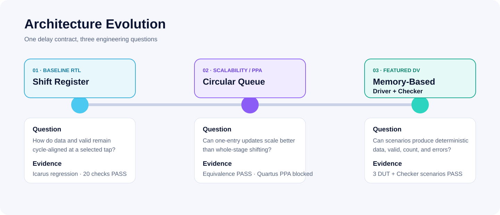

# Architecture Evolution

The portfolio preserves a common programmable-delay contract while changing the storage and verification strategy.

## Stage 1 — Shift Register Baseline

`data_shift` and `enable_shift` move in parallel. `iDelay=N` selects index `N-1`. This makes cycle semantics visible and easy to inspect, but every stage switches each clock.

## Stage 2 — Circular Queue

`write_ptr` advances through fixed time slots and only one entry is updated each clock. `read_ptr=(write_ptr-iDelay) mod DEPTH` selects historical data. The main question moves from functional correctness to scale: whether pointer logic and potential memory inference offset or exceed the baseline cost.

## Stage 3 — Memory-Based File-Driven DV

The DUT retains circular addressing but the portfolio focus moves to verification architecture. A file-driven Input Driver separates data, valid, and configuration sources; an Output Checker compares cycle-level data and valid plus final valid count.

## Stable vs. Changed

| Property | Stable | Deliberate change |
|---|---|---|
| Data width | 16-bit default | none |
| Clock | 100 MHz target | none |
| Delay selection | runtime tap/address | implementation |
| Valid tracking | parallel with data | representation |
| Invalid data policy | no | P1/P2 zero; P3 hold |
| Verification | no | waveform → PPA workflow → self-checking |
