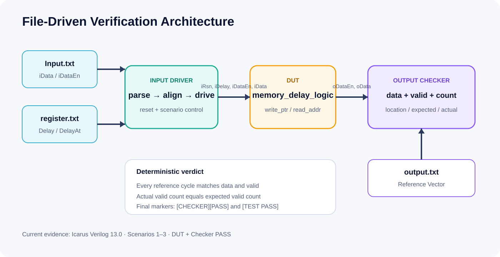

# Verification Strategy

## Project 1 — Self-checking baseline

`tb_delay_logic_regression.sv` drives fixed delay, sparse valid traffic, and runtime delay changes. An independent reference pipeline compares `oData` and `oDataEn` after each active edge. The executed run completed **20 checks with zero errors** and generated a VCD.

## Project 2 — Architecture equivalence

`tb_architecture_equivalence_regression.sv` instantiates the shift-register and circular-queue implementations together. Both outputs are checked against an independent transaction-history model across pointer wrap, sparse valid traffic, and delay changes. The executed run completed **26 checks with zero errors**.

## Project 3 — File-driven self-checking

The Input Driver:

- parses tagged data and valid sections;
- rejects count mismatches;
- reads initial `Delay`;
- applies optional `DelayAt` events before the target input edge;
- supplies idle clocks to flush the delay line.

The Output Checker:

- parses expected data and valid sections;
- compares every reference cycle;
- counts actual valid outputs;
- reports sample position plus expected/actual values;
- emits `[CHECKER][PASS]` or `[CHECKER][FAIL]`.

The top-level testbench emits `[TEST PASS]` only when `error_count==0`. Scenarios 1–3 emitted both PASS markers in the committed console logs.

## Evidence rule

A PASS label requires an executed log. A VCD is retained for waveform review. Configured Quartus projects remain separate from synthesis and PPA results.
