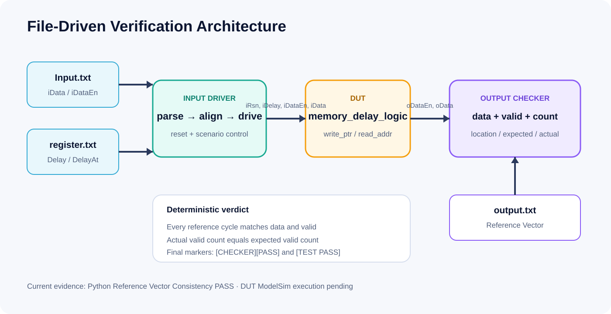

# Verification Strategy

## Project 1: waveform baseline

The testbench drives reset, continuous enabled input at delay 3, and a delay transition from 2 to 5. Review is manual. Expected-waveform PNGs and a cycle table are supplied; no automatic checker result is claimed.

## Project 2: functional waveform plus activity flow

The circular queue receives the same functional scenarios. A second testbench creates matched activity for the four PPA top-level wrappers and can produce VCD files. The configured public PPA method remains vectorless unless the flow is deliberately changed and documented.

## Project 3: file-driven self-checking

The Input Driver:

- parses tagged data and valid sections;
- rejects count mismatches;
- reads initial `Delay`;
- applies optional `DelayAt` events before the target input edge;
- supplies enough idle clocks to flush the delay line.

The Output Checker:

- parses tagged expected data and valid sections;
- compares every reference cycle;
- counts actual valid outputs;
- reports sample position plus expected and actual values;
- emits `[CHECKER][PASS]` or `[CHECKER][FAIL]`.

The top-level testbench emits `[TEST PASS]` only when `error_count==0`.

## Evidence rule

Committed `REFERENCE PASS` text means the Python model and vector files are consistent. It does not mean ModelSim executed the DUT. Scenario simulation logs are committed only after an actual local ModelSim run.

